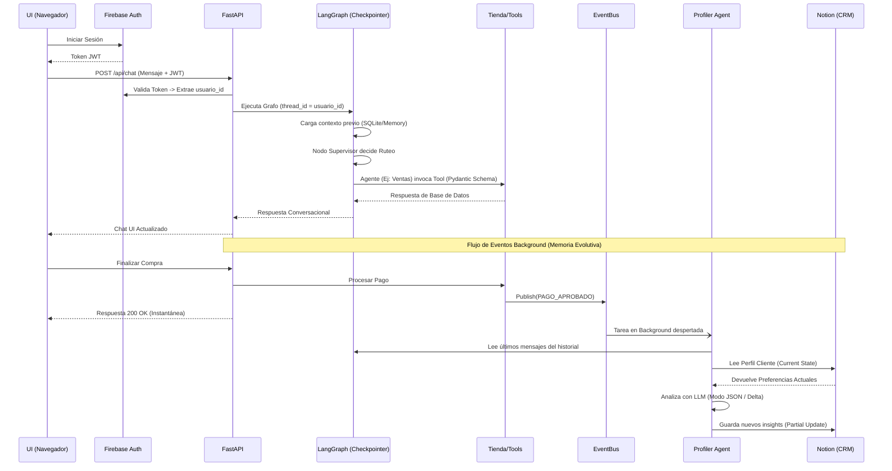

# Arquitectura Técnica de AURA Boutique

Este documento detalla la arquitectura oficial y actual del proyecto AURA Boutique (Fase 3), un sistema de tienda virtual orquestado por LangGraph, con memoria compartida y un Profiler Agent especializado.

## 1. Arquitectura General y Componentes

El sistema sigue una arquitectura moderna dividida en capas orientadas a servicios (SOA) y agentes autónomos:

1. **Frontend**: Interfaz en HTML/JS/CSS vainilla que consume a la API. Integra Firebase para validar la identidad y proveer un token JWT inmutable.
2. **Backend (FastAPI)**: Orquesta las solicitudes HTTP, protege las rutas con JWT, mantiene el `EventBus` para eventos asíncronos y sirve de puente/orquestador general del backend.
3. **LangGraph (Capa Cognitiva de Corto Plazo)**: Grafo de estado y conversacional. Un nodo *Supervisor* recibe el input, y rutea el flujo a sub-agentes especialistas. Todo el estado está respaldado por un Checkpointer (`MemorySaver` / SQLite).
4. **Profiler Agent (Memoria Evolutiva de Largo Plazo)**: Una tarea en *Background* que escucha eventos de negocio de alto valor (ej. `PAGO_APROBADO`). Lee el historial conversacional reciente y extrae insights semánticos (preferencias, tallas) del cliente hacia el CRM.
5. **Capa de Datos y CRM (Notion & Firebase)**: 
   - Firebase garantiza la identidad unívoca (`usuario_id`).
   - Notion actúa como un Headless CRM, manteniendo bases de datos de `CLIENTES` (estado evolutivo) y `ÓRDENES` (transacciones).

---

## 2. Decisiones Arquitectónicas

Cada tecnología elegida resuelve problemas específicos de sistemas multi-agentes en producción:

| Componente | Decisión Justificada |
| :--- | :--- |
| **LangGraph (vs LangChain tradicional)** | Permite crear flujos cíclicos (state machines) y controlar el flujo de forma determinista mediante el ruteo. Previene que los subagentes invoquen recursivamente funciones que no deberían. Su uso de `TypedDict` mejora el performance del guardado del estado. |
| **SQLite / Checkpointer** | En lugar de inyectar todo el string del chat en los prompts, el Checkpointer persiste la sesión del usuario (`thread_id`) de manera nativa. Esto asegura aislamiento entre clientes (evitando cruce de carritos) y habilita interacciones multi-turno de forma impecable. |
| **Notion (Headless CRM)** | Es altamente visual para el administrador del negocio. La IA puede modificar el CRM mediante API (`notion-client`), pero el administrador humano puede leer y sobrescribir datos fácilmente en una interfaz amistosa, creando un flujo "Human-in-the-Loop". |
| **Firebase (Auth)** | Delega completamente el problema de seguridad de credenciales e identidades. Aporta el `usuario_id` que servirá de *Primary Key* en todas las bases de datos posteriores (LangGraph y Notion). |
| **EventBus & Background Tasks** | El negocio exige que la compra sea rápida. Si la extracción del perfil (Profiler Agent) detuviera el Request del cliente para procesar la factura y llamar a Notion, el cliente esperaría +5 segundos. El EventBus permite un patrón *Fire-and-Forget* asíncrono; el usuario recibe confirmación inmediata de pago, y el Profiler trabaja tras bambalinas. |
| **Profiler Agent (Lectura Read-Modify-Write)** | Para no sobrescribir preferencias cargadas manualmente por un humano en el CRM, el Profiler lee el estado actual de Notion, aplica el *Delta* sugerido por LLM, y realiza actualizaciones parciales (Partial Updates), asegurando soberanía de datos. |

---

## 3. LangGraph, Nodos y Roles de los Agentes

La orquestación migró de un modelo en estrella manual a un `StateGraph` de LangGraph. 

- **Estado (`AgentState`)**: Contiene `messages`, `user_id`, `current_agent`, y datos transaccionales como una copia temporal del `cart`.
- **Ruteo**: Las peticiones de usuario siempre entran por el nodo `Supervisor` (LLM). Él decide la intención (Intent) y encamina hacia el agente especialista adecuado, garantizando **Cero Solapamiento de Funciones**.

### Cuadro de Roles Estrictos (Sin Solapamiento)

| Agente / Nodo | Responsabilidad Única | Tools Asignadas |
|---|---|---|
| **Supervisor** | Clasifica intención y enruta al subagente. No ejecuta lógica comercial. | *(Ninguna)* |
| **Catálogo** | Busca y filtra productos. Recomienda ítems similares o alternativos. | `buscar_productos`, `obtener_producto` |
| **Inventario** | Verifica stock exacto. (Si hay desabastecimiento, emite evento). | `verificar_inventario`, `buscar_productos` |
| **Ventas** | Mantiene y modifica el carrito de compras del usuario actual. | `agregar_al_carrito`, `ver_carrito`, `vaciar_carrito` |
| **Pagos** | Genera orden de compra final y procesa el pago simulado. | `crear_pedido`, `procesar_pago` |
| **Soporte** | Consulta el estatus de órdenes. | `consultar_pedido` |

---

## 4. Servidor MCP como Fallback (Infraestructura Legacy)

Originalmente, el sistema operaba bajo *Model Context Protocol* (MCP). 
Para no quebrar la compatibilidad de herramientas en otras partes, **se mantuvo el código del MCP intacto**.
- Las "Tools" de LangChain (`tools/store_tools.py`) funcionan como un adaptador puro sobre la capa de servicios (`services/`).
- En caso de necesitar conectarse al ecosistema a través del IDE o asistentes que demanden MCP puro, el archivo `server/mcp_server.py` sigue operativo, permitiendo que ambas arquitecturas convivan pacíficamente consumiendo la misma lógica de tienda.

---

## 5. Diagrama de Flujo (End to End)

El siguiente diagrama detalla la arquitectura completa, desde la solicitud web hasta el EventBus y la actualización en Notion:

